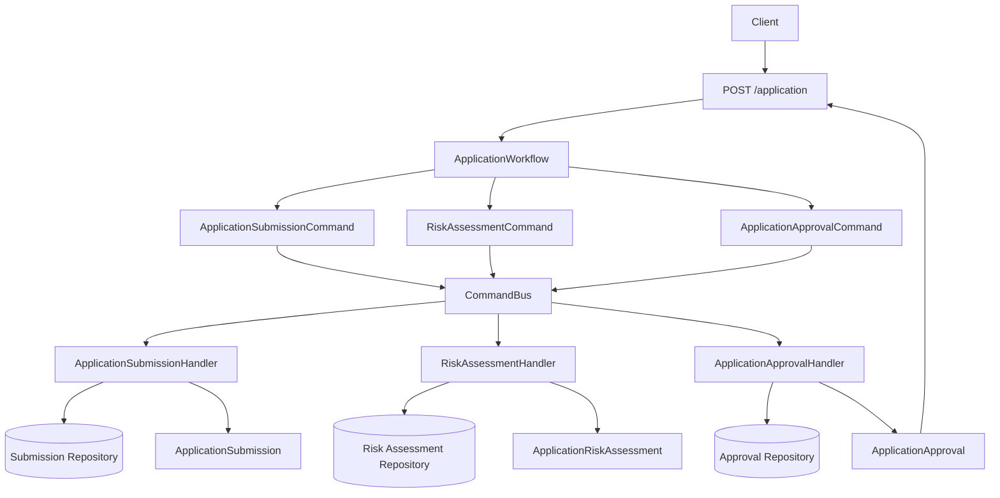

# CreditFlow

A small FastAPI service for assessing a credit application through a simple
command workflow:

1. submit the application
2. assess risk
3. decide approval

The HTTP layer stays thin. It passes the request into an application workflow,
and the workflow coordinates commands through a command bus.

## Architecture



## Project Layout

- `app/main.py`: FastAPI entrypoint and route definition.
- `app/workflows/`: application-level orchestration.
- `app/commands/`: command models and command bus.
- `app/handlers/`: command handlers for submission, risk, and approval.
- `app/repositories/`: in-memory repository abstraction.
- `app/schemas/`: request and response schemas.
- `app/logging_config.py`: structured JSON logging setup.

## Development

Run tests:

```bash
uv run pytest
```

Run the type checker:

```bash
uv run pyright app
```
